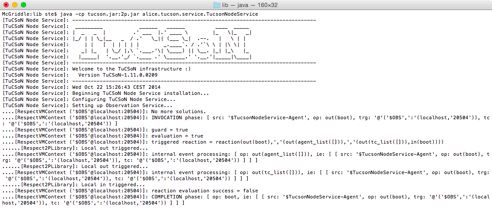

# TuCSoN "how-to"

In this brief "how-to", you will learn how to get TuCSoN, build it and run examples showcasing its features.

Assumptions are you are familiar with Java (compilation), Git (cloning repositories) and, optionally, ANT (buildfiles).

---

1. <a href="#getting">Getting Started with TuCSoN</a>
   
   1.1 <a href="#downloading">Downloading</a>
   
   1.2 <a href="#compiling">Compiling</a>
   
   1.3 <a href="#deploying">Deploying</a>
   
   1.4 <a href="#running">Running</a>
   
   
2. <a href="#contact">Contact Information</a>

---

### 1. <a name="getting">Getting Started with TuCSoN</a>

###### 1.1 <a name="downloading">Downloading</a>

If you want the *ready-to-use* distribution of TuCSoN, download **TuCSoN-1.11.0.0209.jar** archive from the "Downloads" section, here > <http://bitbucket.org/smariani/tucson/downloads>. **TuCSoN_boot.sh** bash script is also available for quick boot of TuSCoN components and examples.

If you want the *source code* of TuCSoN, clone the TuCSoN **[Git](http://git-scm.com) repository** hosted here on Bitbucket, at > <http://smariani@bitbucket.org/smariani/tucson.git> (e.g., from a command prompt type `$> git clone https://smariani@bitbucket.org/smariani/tucson.git`) <a href="#1">\[1\]</a>.

In the former case, skip to the "<a href="#running">Running</a>" section below. In the latter case, keep reading.

###### 1.2 <a name="compiling">Compiling</a>

By cloning TuCSoN you have downloaded a folder named `tucson/`, with the following *directory structure*:

    tucson/
    |__...
    |__TuCSoN/
       |__...
       |__ant-scripts/
          |__build.xml
          |__environment.properties
       |__eclipse-config/
       |__how-to/
       |__license-info/
       |__trunk/
          |__src/

TuCSoN depends on 1 other Java library to function properly <a href="#2">\[2\]</a>:

 * **tuProlog**, downloadable from tuProlog "Download" page, here > <http://apice.unibo.it/xwiki/bin/view/Tuprolog/Download> (**2p.jar**)
 
Once you got the above libraries, you are ready to compile TuCSoN source code. 

The easiest way to do so is by exploiting the [ANT](http://ant.apache.org) script named `build.xml` within folder `ant-scripts/`, which takes care of the whole building process for you, from compilation to deployment (covered in next section). To do so, you need to have ANT installed on your machine <a href="#3">\[3\]</a>. If you don't want to use ANT, build TuCSoN jar archive using the tools you prefer, then skip to the "<a href="#running">Running</a>" section below.

To compile TuCSoN using ANT:

 1. Edit the `environment.properties` file according to your system configuration:
 
    1.1 Tell ANT where your JDK and your `java` tool are
    
    1.2 Tell ANT which libraries are needed to compile TuCSoN (the one you just downloaded, that is tuProlog)
    
    1.3 Tell ANT where you put such libraries (e.g. if you put them into `TuCSoN/libs/` you are already set)
    
    *\[1.4 Tell ANT your Bitbucket username (for automatic syncing with TuCSoN repository, **not supported at the moment**)\]*
 
 2. Launch the ANT script using target `compile` (e.g., from a command prompt position yourself into the `ant-scripts/` folder then type `$> ant compile`) <a href="#4">\[4\]</a>. This will create folder `classes/` within folder `TuCSoN/` and therein store Java `.class` files.
 
Other ANT targets are available through the `build.xml` file: to learn which, launch the ANT script using target `help`.

###### 1.3 <a name="deploying">Deploying</a>

Deploying TuCSoN is as simple as giving a different build target to the ANT script `build.xml`:

 * if you only want the **TuCSoN jar** archive, ready to be included in your Java project, launch the script using target `lib`. This will compile TuCSoN source code into binaries (put into `TuCSoN/classes/` folder) then package them to **TuCSoN-1.11.0.0209.jar** into `TuCSoN/lib/` folder <a href="#5">\[5\]</a>.
 
 * if you want a **ready-to-release distribution** of TuCSoN, including also documentation and support libraries, launch the script using target `dist`. This will:
   
   * compile TuCSoN source code into binaries, put into `TuCSoN/classes/` folder
   * package them to TuCSoN-1.11.0.0209.jar, put into `TuCSoN/lib/` folder
   * generate Javadoc information, put into `TuCSoN/doc/` folder
   * create folder `rel/TuCSoN-1.11.0.0209` including:
   
     * folder `docs/` including the generated Javadoc information as well as this "how-to"
     * folder `libs/` including tuProlog library used to build TuCSoN
     * folder `rel/` including TuCSoN jar archives
     
The complete directory structure obtained by launching `ant dist` build process should look like the following (assuming you put tuProlog library in folder `TuCSoN/libs/`):

    tucson/
    |__...
    |__TuCSoN/
       |__...
       |__ant-scripts/
          |__build.xml
          |__environment.properties
       |__classes/
       |__doc/
       |__eclipse-config/
       |__how-to/
       |__rel/
          |__TuCSoN4JADE-1.0/
             |__docs/
                |__how-to/
                |__javadoc/
             |__libs/
             |__rel/
          |__...
       |__lib/
       |__libs/
       |__license-info/
       |__trunk/
          |__src/

Other ANT targets are available through the `build.xml` file: to learn which, launch the ANT script using target `help`.

###### 1.4 <a name="running">Running</a>

To run TuCSoN, you need:

 * TuCSoN jar, e.g. **TuCSoNTuCSoN-1.11.0.0209.jar**
 * tuProlog jar, e.g. **2p.jar**

Supposing you built TuCSoN using the provided ANT script <a href="#6">\[6\]</a> and that you are comfortable with using a command prompt to launch Java applications <a href="#7">\[7\]</a>:

 1. open a command prompt and position yourself into either `TuCSoN/lib/` or `TuCSoN/rel/TuCSoN-1.11.0.0209/rel/` folder
 2. launch the TuCSoN Node service, e.g. as follows <a href="#8">\[8\]</a>:
 
         java -cp TuCSoN-1.11.0.0209.jar:../libs/2p.jar alice.tucson.service.TucsonNodeService

The TuCSoN ASCII logo on the command prompt, as depicted below.

As long as no TuCSoN agents start exploiting TuCSoN coordination services, nothing happens. Thus, here follows instructions on how to launch one of the example applications shipped within TuCSoN-1.11.0.0209.jar, showcasing its features: the *old-but-gold* "Dining Philosophers" example (package `alice.tucson.examples.timedDiningPhilos.TDiningPhilosophersTest`).

Supposing you successfully launched the TuCSoN Node Service as described above, to launch the "Dining Philosophers" example:
      
 1. open a new command prompt window/tab and position yourself into either `TuCSoN/lib/` or `TuCSoN/rel/TuCSoN-1.11.0.0209/rel/` folder
 2. launch the "Dining Philosophers" example, e.g. as follows <a href="#8">\[8\]</a>:
 
         java -cp TuCSoN-1.11.0.0209.jar:../libs/2p.jar alice.tucson.examples.timedDiningPhilos.TDiningPhilosophersTest

You should see many prints on the command prompt, tracking what the philosophers are doing.

---

### <a name="contact">Contact Information</a>

**Author** of this "how-to":

 * *Stefano Mariani*, DISI - Università di Bologna (<s.mariani@unibo.it>)

**Authors** of TuCSoN in TuCSoN "People" section of its main site, here > <http://apice.unibo.it/xwiki/bin/view/TuCSoN/People>
 
---

<a name="1">\[1\]</a> Git standalone clients are available for any platform (e.g., [SourceTree](http://www.sourcetreeapp.com) for Mac OS and Windows). Also, if you are using [Eclipse IDE](http://www.eclipse.org/home/index.php) for developing in JADE, the [EGit plugin](http://marketplace.eclipse.org/content/egit-git-team-provider) is included in the [Java Developers version](http://www.eclipse.org/downloads/packages/eclipse-ide-java-developers/lunasr1) of the IDE.

<a name="2">\[2\]</a> Recommended tuProlog version is **2.9.1**. Others (both newer and older) may work properly, but they have not been tested.

<a name="3">\[3\]</a> Binaries available [here](http://ant.apache.org/bindownload.cgi), installation instructions covering Linux, MacOS X, Windows and Unix systems [here](http://ant.apache.org/manual/install.html).

<a name="4">\[4\]</a> If you are using [Eclipse IDE](http://www.eclipse.org/home/index.php) for developing in Java, ANT is included: click "Window > Show View > Ant" then click "Add buildfiles" from the ANT view and select file `build.xml` within `ant-scripts/` folder. Now expand the "TuCSoN build file" from the ANT view and finally double click on target `compile` to start the build process.

<a name="5">\[5\]</a> Actually, also a **TuCSoN-1.11.0.0209-noexamples.jar** is built. It is the same as **TuCSoN-1.11.0.0209.jar** except for the explanatory examples in package `alice.tucson.examples.*`, which are excluded.

<a name="6">\[6\]</a> If you directly downloaded TuCSoN jar or if you built it from sources without using the provided ANT script, simply adjust the given command to suit your configuration.

<a name="7">\[7\]</a> If you do not want to use the command prompt to launch Java applications, adjust the given command to suit your configuration, e.g., if your are using [Eclipse IDE](http://www.eclipse.org/home/index.php): right-click on "TuCSoN-1.11.0.0209.jar > Run As > Run Configurations..." then double-click on "Java Application", finally select "TucsonNodeService - alice.tucson.service" as the main class (`-cp TuCSoN-1.11.0.0209.jar:../libs/2p.jar` is automatically added by Eclipse according to project's build path settings).

<a name="8">\[8\]</a> Separator `:` works on Mac & Linux only, use `;` on Windows.

<a name="9">\[9\]</a> Actually, a TuCSoN agent identifier can be any valid tuProlog *ground term*. See tuProlog documentation, [here](http://apice.unibo.it/xwiki/bin/download/Tuprolog/Download/tuprolog-guide-2.9.0.pdf).

---