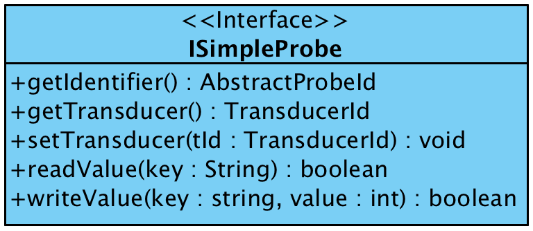
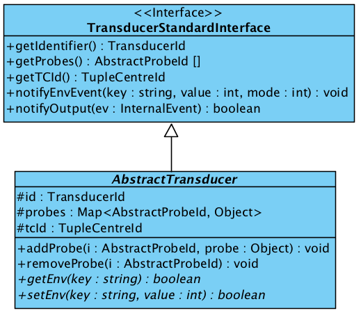
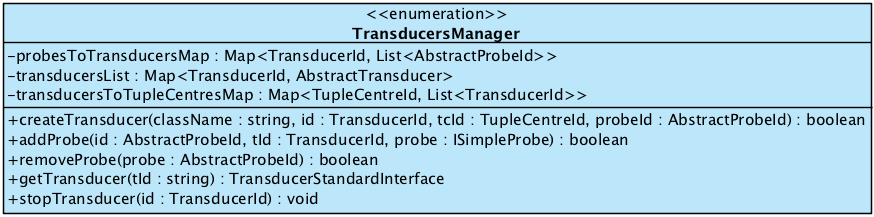

# Situatedness in TuCSoN (with ReSpecT)

In this brief "how-to", you will learn TuCSoN and [ReSpecT](http://respect.apice.unibo.it) main API available to developers of *situated MAS*, willing to exploit TuCSoN-provided *situated coordination* facilities.

Assumptions are you are familiar with TuCSoN core API and ReSpecT programming.

Prior to reading this how-to is *highly recommended* to **read the reference paper** on supporting situatedness in MAS:

 * Casadei, M., Omicini, A.: *"Situated tuple centres in ReSpecT"*. In Shin, S.Y., Ossowski, S., Menezes, R., Viroli, M., eds.:
   24th Annual ACM Symposium on Applied Computing (SAC 2009). Volume III., Honolulu, Hawai’i, USA, ACM (8–12 March 2009) 1361
   1368
   
available from [here](http://apice.unibo.it/xwiki/bin/view/Publications/RespectSac09).

Suggested readings complementing the content of this "how-to" are:

 * Mariani, S., Omicini, A.: *"Coordination in Situated Systems: Engineering MAS Environment in TuCSoN"*. In Internet and Distributed Computing Systems, Lecture Notes in Computer Science 8729, 22-24 September 2014. Available [here](http://apice.unibo.it/xwiki/bin/view/Publications/SituatedcoordIdcs2014).
 
 * Mariani, S., Omicini, A.: *"TuCSoN Coordination for MAS Situatedness: Towards a Methodology"*. In WOA 2014 – XV Workshop Nazionale "Dagli Oggetti agli Agenti", CEUR Workshop Proceedings 1260, September 2014. Available [here](http://apice.unibo.it/xwiki/bin/view/Publications/TucsonWoa2014).

---

1. <a href="#situated">Situatedness in TuCSoN</a>

   1.1 <a href="#api">API Overview</a>
   
   1.2 <a href="#hands-on">"Hands-on" step-by-step tour</a>
   
2. <a href="#contact">Contact Information</a>

---

### 1. <a name="situated">Situatedness in TuCSoN</a>

---

###### 1.1 <a name="api">API Overview</a>

Situated coordination services in TuCSoN are mediated by **transducers**, representing *sensors*, *actuators*, "environmental resources" in general within the TuCSoN-coordinated MAS--called **probes**. Thus, designing a situated MAS with TuCSoN amounts at dealing with the following tasks:

 1. implementing probes
 2. implementing their transducers
 3. dynamically instantiating and associating them upon need
 4. implement the situated coordination policies needed by the application at hand

**1. Implement Probes.** While implementing their probes, developers should adhere to the `ISimpleProbe` interface, depicted below:

Methods `readValue`/`writeValue` have to be implemented for sensors and actuators, respectively. These methods should embed the "logic" of interaction with the specific probe, either software (e.g. in a simulation) or hardware (e.g. in a real-world deployment).

Please notice: being creation and association of classes implementing probes and transducers dynamic, within such methods **it is good practice to**:

 1. *check if the association with the transducer has been done*. It is good practice to give the probe a private member field storing the id of the associated transducer (as requested by method `getTransducer`) and to check such field for existence prior to reading or writing
 2. if the association has been done (such field is not `null`), *a reference to the transducer should be retrieved*, using method `getTransducer` of singleton class `TransducersManager`--whose reference, *unique per TuCSoN node*, can be obtained by calling `TransducerManager.INSTANCE`

Once the probe and its transducer have been implemented, run-time creation and association can be achieved by exploiting the Transducers Manager (see point 3 below).

**2. Implement Transducers.** TuCSoN supports developers in implementing transducers by providing the `AbstractTransducer` Java class depicted below:

Such class should be subclassed implementing **at least one** <a href="#1">\[1\]</a> of its protected methods, depending on whether the transducer is responsible for a *sensor* or an *actuator*:

 * `getEnv` is meant for sensor transducers. It "stimulates" the sensor probe to perceive the property of the portion of the MAS environment it can observe (`key` parameter), outputting the perceived value in the tuple centre the transducer is bound to.
 * `setEnv` is meant for actuator transducers. It commands the actuator probe to modify the property of the portion of the MAS environment it can act upon.

For both methods, the most simple and straightforward implementation is to iterate through the protected member field `this.probes` (storing the list of the probes associated to the transducer) to read/write the value of the environmental property of interest, by using method `readValue`/`writeValue`. The method should return a `boolean` value representing success or failure of the operation.

**3. Exploit the Tranducers Manager.** TuCSoN provides services for creation, (de)registration, etc. of transducers and probes, which have to be requested through *well-formed tuples to be put into the special tuple centre* `'$ENV’`:

 * `createTransducerSensor(@Tcid,@Tclass,@Tid,@Pclass,@Pid)`, where:
    * `Tcid` is the `TucsonTupleCentreId` of the tuple centre mediating transducer's interactions--**must be** `'$ENV'`
    * `Tclass` is the *full name* of the Java class implementing the transducer
    * `Tid` is the id <a href="#2">\[2\]</a> of the transducer we are requesting to be created, to be used, e.g., within ReSpecT reactions
    * `Pclass` is the *full name* of the Java class implementing the probe this transducer will manage
    * `Pid` is the id <a href="#2">\[2\]</a> of the probe this transducer will manage, to be used, e.g., for the other management operations listed here
 * `createTransducerActuator(@Tcid,@Tclass,@Tid,@Pclass,@Pid)`, whose parameters are the same as above
 * `addSensor(Class,@Pid,@Tid)`, where:
    * `Class` is the full name of the Java class implementing the probe to be added to the list of those probes managed by the transducer `Tid`, which must be **already existing**
    * `Pid` is the id of the probe we are adding to the situated MAS
    * `Tid` is the id of the transducer which this probe should be added to
 * `addActuator(Class,@Pid,@Tid)`, whose parameters are the same as above
 * `removeResource(@Pid)`, where:
    * `Pid` is the id of the probe to be deregistered and terminated
 * `changeTransducer(@Pid,@Tid)`, where:
    * `Pid` is the id of the probe whose management should be given to another transducer, which must be **already existing**
    * `Tid` is the id of the transducer which should manage the probe from now on
    
The TuCSoN architectural component in charge of executing such management operations is the `TransducersManager`, whose API is depicted below:

**4. Exploit ReSpecT programming.** 

Likewise transducers mediate between environmental resources (the probes) and the MAS, tuple centres mediate between transducers and agents. Tuple centres mediation is *necessary* because `getEnv` and `setEnv` are ReSpecT-only primitives, not accessible to TuCSoN agents. This enforces *decoupling* and leverages *encapsulation* as well as *separation of concerns*.

ReSpecT programming is necessarily application-specific, but a core of general purpose operations to carry out can be devised <a href="#3">\[3\]</a>:

 * first of all, it is necessary to *react to an interaction request issued by an agent toward a probe*. **The agent request is reified in a tuple**, which ReSpecT interprets to call the right operation on the transducer associated to the probe target of the operation (`getEnv` or `setEnv`)
   * e.g., in the case of a *sensor*

            reaction(
                 in(sense(temp(T))),
                    (operation, invocation),
                    sensor@localhost:20504 ? getEnv(temp, T)
            ).
where `sensor` is the `Pid` of the probe (the `Tid` of the associated transducer is automagically retrieved by ReSpecT).

 * then, it is possible to *react to the event of operation completion by the resource*, that is, to the environmental event generated (either reactively or proactively) by the probe (`getEnv` or `setEnv`)
   * e.g., following previous ReSpecT specification

            reaction(
                 getEnv(temp, T),
                 (from_env, completion),
                     out(sense(temp(T)))
            ).
where `from_env` is the guard predicate filtering events coming from the environment (thus, from a transducer).

---

###### 1.1 <a name="hands">"Hands-on" step-by-step tour</a>

*TBD*.

In the meanwhile, you can read through the comments in TuCSoN "Thermostat MAS" example source files, [here](https://bitbucket.org/smariani/tucson/src/da7cf3835c62/TuCSoN/trunk/src/alice/tucson/examples/situatedness/?at=master).

---

### <a name="contact">Contact Information</a>

**Author** of this "how-to":

 * *Stefano Mariani*, DISI - Università di Bologna (<s.mariani@unibo.it>)

**Authors** of TuCSoN in TuCSoN "People" section of its main site, here > <http://apice.unibo.it/xwiki/bin/view/TuCSoN/People>.
 
---

<a name="1">\[1\]</a> Also both methods can be implemented, e.g. if the transducer is responsible for a probe able to behave both as a sensor and as an actuator.

<a name="2">\[2\]</a> For both transducers’ and probes' ids the same syntactic rules as those for agent ids and tuple centres ids hold, that is, any valid [tuProlog](http://tuprolog.unibo.it) *ground term*. See tuProlog documentation, [here](http://apice.unibo.it/xwiki/bin/download/Tuprolog/Download/tuprolog-guide-2.9.0.pdf).

<a name="3">\[3\]</a> What follows is based on the example in package `alice.tucson.examples.situatedness`, which can be run either by using the bash script `TuCSoN_boot.sh` or by typing `$> java -cp tucson.jar alice.tucson.examples.situatedness.Thermostat` in a command prompt (a TuCSoN node should be active on `localhost:20504`).